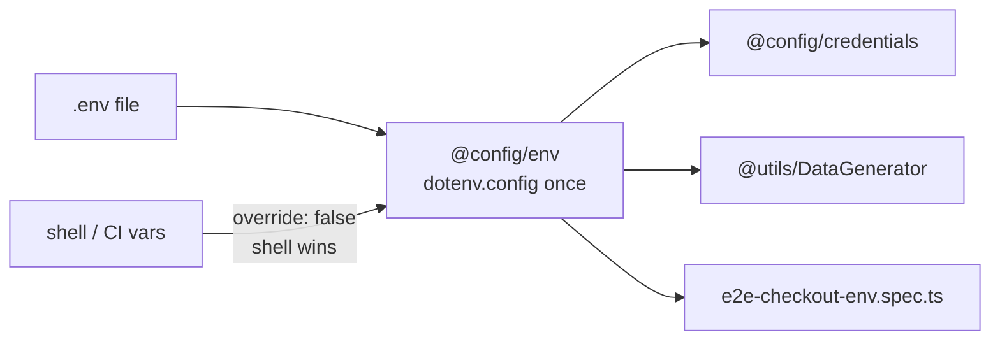

# Advance Playwright Framework 2x

A TypeScript test automation framework built on [Playwright](https://playwright.dev/) for UI and API testing, with a modular structure for page objects, fixtures, config, and test data.

## Tech Stack

- **Playwright** (`@playwright/test`) - browser automation and test runner
- **TypeScript** - strict mode enabled
- **Faker.js** - test data generation
- **Ajv / ajv-formats** - JSON schema validation
- **jsonpath-plus** - JSON response querying
- **csv-parse / xlsx** - data-driven testing from CSV/Excel sources
- **Winston** - logging
- **Allure Playwright** - test reporting
- **dotenv** - environment configuration

---

## Architecture

### Page Object Model (POM)

**Concept:** Every page in the application has a corresponding TypeScript class. Locators live at the top of the class, actions below them, and navigation helpers at the bottom. A shared `BasePage` class provides `page`, `el` (element locator wrapper), `log` (scoped logger), and a `goto()` helper.

**Why:** Without POM, selectors scatter across test files. One UI change breaks dozens of tests. With POM, you fix the locator in one place and every test using that page recovers.

**Q&A — why use this?**

- **Q: What goes in the BasePage vs the subclass?** A: BasePage holds cross-cutting plumbing (`page`, `el`, `log`, `goto`). Subclasses declare their own `private readonly` Locator fields and domain actions like `loginAs()`.
- **Q: How do I add a new page?** A: Create `src/pages/NewPage.ts`, extend `BasePage`, declare locators, add actions, then instantiate from tests or fixtures.
- **Q: What's the `Flex` type in `UtilElementLocator`?** A: `string | Locator`. Pass a CSS string like `'[data-test="login-button"]'` or a built Playwright `Locator`. The wrapper resolves both, so call sites stay clean.

```mermaid
flowchart TD
    TEST[Test Spec] -->|new LoginPage&#40;page&#41;| LP[LoginPage]
    LP --> BP[BasePage]
    BP --> EL[UtilElementLocator]
    BP --> LOG[Winston Logger]
    LP -->|open&#40;&#41;| GOTO["page.goto&#40;PATH&#41;"]
    LP -->|loginAs&#40;u,p&#41;| ACTIONS["el.fill + el.click"]
    TEST -->|expect| PW[Playwright Assertions]
```



```ts
// src/pages/LoginPage.ts
export class LoginPage extends BasePage {
    static readonly PATH = '/playwright/ttacart/index.html';

    private readonly usernameInput = this.page.locator('[data-test="username"]');
    private readonly passwordInput = this.page.locator('[data-test="password"]');
    private readonly loginButton   = this.page.locator('[data-test="login-button"]');

    constructor(page: Page) {
        super(page, 'LoginPage');
    }

    async open(): Promise<void> {
        await this.goto(LoginPage.PATH);
    }

    async loginAs(username: string, password: string): Promise<void> {
        await this.el.fill(this.usernameInput, username);
        await this.el.fill(this.passwordInput, password);
        await this.el.click(this.loginButton);
    }
}
```

### UtilElementLocator

**Concept:** A thin wrapper around Playwright's `Locator` API that adds scoped logging, configurable timeouts, and a unified `Flex` type. Every action (`click`, `fill`, `type`, `hover`, etc.) goes through this wrapper so every interaction is traceable in logs.

**Why:** Raw `locator.click()` in a POM method leaves no log trail. When a test fails in CI at 3 AM, you want to see `[LoginPage] click [data-test="login-button"]` in the logs, not guess which locator threw.

**Q&A — why use this?**

- **Q: When do I use `el.click()` vs `page.locator(...).click()` directly?** A: Always use `el.*` inside Page Object methods. Direct `page.locator()` is fine for test-level one-liners when the POM doesn't own that element.
- **Q: What's the default timeout?** A: 15 seconds (`DEFAULT_ACTION_TIMEOUT_MS`). Pass a second argument to override per-call.
- **Q: Does it work with `getByTestId` / `getByRole` locators?** A: Yes. `Flex` accepts any `Locator`, including those built by Playwright's built-in locator factories.

```ts
// Every action logs scope + target + timing
await this.el.fill(this.usernameInput, username);     // [LoginPage] fill [data-test="username"]
await this.el.click(this.loginButton);                 // [LoginPage] click [data-test="login-button"]
await this.el.waitForVisible(this.errorBox);           // waits up to 15 s with auto-retry
```

### Logger

**Concept:** Winston-backed structured logger with scope tagging. Create a child logger per class (`createLogger('LoginPage')`) and every line carries the scope label. Output goes to both colourised console (for local dev) and `logs/combined.log` (for CI artifacts).

**Why:** `console.log` doesn't carry timestamps, levels, or scope. Winston gives you timestamped, leveled, scoped logs with zero config. Filter by level via `LOG_LEVEL` env var (default `info`).

**Q&A — why use this?**

- **Q: How do I silence debug logs in CI?** A: Set `LOG_LEVEL=info` (default). For verbose local debugging, `LOG_LEVEL=debug`.
- **Q: Where do log files go?** A: `logs/combined.log` in the project root. This directory is git-ignored.
- **Q: Can I log from test specs directly?** A: Yes. Import `createLogger` and pass the spec name as scope.

```ts
import { createLogger } from '@utils/logger';
const log = createLogger('login.spec');
log.info('Opening the TTACart login page');
// 2026-08-12 08:05:13 [info] [login.spec] Opening the TTACart login page
```

For the complete level reference and examples, see [`src/utils/KBlogger.md`](src/utils/KBlogger.md).

### Composable Playwright Fixtures

`src/fixtures/test-base.ts` exports the project's custom `test` object. In addition to page-object fixtures, it provides four ready-to-use application states:

| Fixture | State prepared before the test starts |
|:--------|:--------------------------------------|
| `invalidLogin` | Attempts login as `locked_out_user` and verifies that the login error is visible |
| `validLogin` | Logs in successfully as `standard_user` |
| `loginWithInventory` | Runs `validLogin` and verifies that the inventory page is loaded |
| `loginWithSelectedItem` | Runs `loginWithInventory` and adds one configured item to the cart |

Fixtures are lazy. Playwright runs only the fixture requested by a test and that fixture's dependencies. For example, requesting `loginWithSelectedItem` automatically performs valid login and inventory setup first:

```ts
import { test, expect } from '@fixtures/test-base';

test('cart starts with one selected item', async ({
    loginWithSelectedItem,
    cartPage,
}) => {
    await cartPage.open();
    expect(await cartPage.rowCount()).toBe(1);
    expect(loginWithSelectedItem.itemId).toBeTruthy();
});
```

The same file also injects a page-object fixture for every TTACart screen (`loginPage`, `inventoryPage`, `itemDetailPage`, `cartPage`, `checkoutStepOnePage`, `checkoutStepTwoPage`, `checkoutCompletePage`). Those fixtures construct the POM against the test's `page` without navigating; state fixtures do the reusable setup.

The fixture definitions remain centralized in `test-base.ts`. See `src/tests/e2e/e2e-checkout_new_fixture.spec.ts` for independent invalid-login and complete-checkout examples.

### Credentials

**Concept:** `src/config/credentials.ts` centralises the standard TTACart account. Username and password are read through `envOr` from [`@config/env`](#environment-reader-configenv), so they come from `STANDARD_USER` and `TTA_SECRET` when set and fall back to `standard_user` / `tta_secret` otherwise.

**Why:** Specs should not hard-code demo credentials. Checkout tests import `credentials` and login specs / fixtures read accounts from `src/testdata/logintestdata.json` (valid, locked-out, and other SauceDemo-style users). Importing `@config/env` is also what guarantees `.env` is loaded before these values are computed.

```ts
import { credentials } from '@config/credentials';

await loginPage.loginAs(credentials.standardUser, credentials.password);
```

### Environment Reader (`@config/env`)

**Concept:** `src/config/env.ts` is the single entry point for reading `.env`. Importing it loads the file into `process.env` once, then exposes three typed readers so nothing else touches `process.env` directly.

| Function | Behaviour |
|:---------|:----------|
| `requireEnv(key)` | Returns the value, throws with an actionable message when unset or blank |
| `envOr(key, fallback)` | Returns the value, or the fallback when unset |
| `assertEnv(...keys)` | Checks several keys exist without returning them, reporting every missing key at once |

**Why:** Playwright transpiles TypeScript through Babel, whose CommonJS transform **hoists every `import` to the top of the file**. A `dotenv.config()` call written between two imports therefore runs *after* both of them, so a module that reads `process.env` at load time is computed against an unloaded `.env`, silently using the wrong value. Putting the load inside a module that others import turns that hoisting from a hazard into a guarantee.

**Q&A — why use this?**

- **Q: Do I still need `dotenv.config()` in my spec?** A: No, and you should not add one. Import `@config/env` (or anything that imports it, such as `@config/credentials`) and the file is already loaded.
- **Q: Does a shell variable beat the `.env` file?** A: Yes. `override` stays at dotenv's default `false`, so `FOO=bar npx playwright test` wins over the file. That is correct for CI, and it is how you prove a value is genuinely being injected.
- **Q: What happens when a required key is missing?** A: `requireEnv` and `assertEnv` throw at module load, which is *collection* time, so the run stops immediately instead of failing later at a login screen. Note this fails the whole run, not one test, which is why CI seeds a `.env` (see [Continuous Integration](#continuous-integration)).



```ts
import { assertEnv, requireEnv, envOr } from '@config/env';

assertEnv('STANDARD_USER', 'TTA_SECRET');          // fail fast, values read elsewhere
const ITEM_ID = requireEnv('CHECKOUT_ITEM_ID');    // required
const zip = envOr('CHECKOUT_POSTAL_CODE', '560001'); // optional with fallback
```

### visualStep

**Concept:** `src/utils/visualStep.ts` wraps `test.step`. When `ATTACH_SCREENSHOTS=true`, it takes a screenshot at the end of the step and attaches it so the TTA reporter can show it next to that step.

**Why:** Playwright's built-in `test.step` has no screenshot. Checkout specs use `visualStep` so the HTML report can replay each checkout stage visually without enabling screenshots for every locator click.

```ts
import { visualStep } from '@utils/visualStep';

await visualStep(page, 'Open the cart', async () => {
    await cartPage.open();
});
```

### Custom TTA Reporter

**Concept:** `CustomTTAReporter` generates a self-contained HTML report (`tta-report/`) with real-time updates during the run. When `ATTACH_SCREENSHOTS=true`, it embeds step and failure screenshots. It also embeds video (always), trace zip files (always), step-level timelines, console logs, and three AI-powered tabs: AI Data, AI Verdict (RCA), and Flaky analysis.

**Why:** Playwright's built-in HTML reporter is a flat table. The TTA reporter adds expandable step details with video timestamps, per-step screenshots, inline console output, filterable tags, and an AI verdict pipeline for root-cause analysis on failures.

**Q&A — why use this?**

- **Q: How is it wired in?** A: Listed as a reporter path in `playwright.config.ts`: `['./src/utils/CustomReporter.ts']`. No CLI flag needed.
- **Q: Do the AI tabs work out of the box?** A: The Flaky tab diffs two consecutive runs without any API key. RCA and AI Data tabs need an LLM key set in `src/ai/config/providers.ts`.
- **Q: Where does the report live after a run?** A: `tta-report/report_<runId>.html`. An `index.html` redirect always points to the latest.

| Artifact  | Playwright Config     | TTA Report Behaviour            |
|:----------|:----------------------|:--------------------------------|
| Screenshot | Controlled by `ATTACH_SCREENSHOTS` | Disabled by default; when enabled, failure and `visualStep` screenshots are copied to `tta-report/screenshots/` |
| Video     | `on`                  | Copied to `tta-report/videos/`, embedded as `<video>` in detail panel |
| Trace     | `on`                  | Copied to `tta-report/traces/`, downloadable with step timestamps |

## Project Structure

```
.
├── .claude/
│   ├── commands/
│   │   └── gogo.md        # /gogo: update README, commit, push
│   └── skills/            # 12 agent skills, read by Claude Code AND Copilot
├── .github/
│   ├── copilot-instructions.md  # Repo-wide rules for GitHub Copilot
│   └── workflows/         # CI pipeline (GitHub Actions)
├── .env.example           # Committed template; CI copies it to .env
├── docs/                  # Documentation
├── learnings/
│   ├── NewFeature.md      # How the .env feature was built, step by step
│   └── *.md               # Implementation notes (reporter wiring, dotenv, etc.)
├── rules/                 # Project/test rules and conventions
├── src/
│   ├── ai/
│   │   ├── agents/        # RCA and Flaky AI analysis agents
│   │   └── config/        # LLM provider configuration
│   ├── api/               # API clients / request helpers
│   ├── config/
│   │   ├── credentials.ts # STANDARD_USER / TTA_SECRET with demo fallbacks
│   │   └── env.ts         # Loads .env once; requireEnv / envOr / assertEnv
│   ├── fixtures/
│   │   └── test-base.ts   # Page-object and composable state fixtures
│   ├── pages/             # Page Object Model classes
│   │   ├── BasePage.ts    # Shared scaffolding (page, el, log, goto)
│   │   ├── LoginPage.ts   # Login screen with data-test locators
│   │   ├── InventoryPage.ts
│   │   ├── CartPage.ts
│   │   ├── CheckoutStepOnePage.ts
│   │   ├── CheckoutStepTwoPage.ts
│   │   ├── CheckoutCompletePage.ts
│   │   └── ItemDetailPage.ts
│   ├── testdata/
│   │   └── logintestdata.json # Valid and negative login accounts
│   ├── tests/
│   │   ├── e2e/
│   │   │   ├── e2e-checkout.spec.ts              # Full checkout via visualStep
│   │   │   ├── e2e-checkout-env.spec.ts          # Same flow, every input from .env
│   │   │   └── e2e-checkout_new_fixture.spec.ts  # Fixture-driven login + checkout
│   │   └── login/
│   │       └── login.spec.ts  # Login flow with @p0 smoke tag
│   └── utils/
│       ├── CustomReporter.ts    # TTA HTML reporter with AI tabs
│       ├── DataGenerator.ts     # Faker-based test data (checkoutCustomer, etc.)
│       ├── KBlogger.md          # Supported logger levels and examples
│       ├── UtilElementLocator.ts # Logged locator wrapper (Flex type)
│       ├── visualStep.ts        # Optional per-step screenshot attachments
│       └── logger.ts            # Winston scoped logger
├── playwright.config.ts   # Playwright configuration
├── tsconfig.json          # TypeScript configuration and path aliases
└── package.json
```

## Prerequisites

- Node.js (LTS recommended)
- npm

## Setup

Install dependencies and Playwright browsers:

```bash
npm install
npx playwright install
```

Create your `.env` from the committed template (this is exactly what CI does):

```bash
cp .env.example .env
```

`.env` itself is gitignored. `.env.example` is not, and it is the contract: if a key is required
and missing, the suite stops at collection with a message naming the key. Override defaults there
(see [Environment Configuration](#environment-configuration)):

```bash
TTA_ENV=qa
ATTACH_SCREENSHOTS=false
STANDARD_USER=standard_user
TTA_SECRET=tta_secret
BASE_URL=
QA_BASE_URL=https://app.thetestingacademy.com
STG_BASE_URL=https://stage.thetestingacademy.com
DEV_BASE_URL=http://localhost:3000
PROD_BASE_URL=https://app.thetestingacademy.com
API_BASE_URL=https://restful-booker.herokuapp.com
```

## Environment Configuration

The base URL is resolved in `playwright.config.ts` based on the `TTA_ENV` environment variable:

| `TTA_ENV` value          | Resolves to                                  |
|---------------------------|-----------------------------------------------|
| `qa` (default)            | `QA_BASE_URL` or `https://app.thetestingacademy.com` |
| `dev` / `local`           | `DEV_BASE_URL` or `http://localhost:3000`     |
| `stg` / `stage` / `staging` | `STG_BASE_URL` or `https://stage.thetestingacademy.com` |
| `prod` / `production`     | `PROD_BASE_URL` or `https://app.thetestingacademy.com` |
| `api`                     | `API_BASE_URL` or `https://restful-booker.herokuapp.com` |

`BASE_URL`, if set, always takes precedence over the above.

### Keys read by the suite

| Key | Read by | Required |
|:----|:--------|:---------|
| `STANDARD_USER` / `TTA_SECRET` | `@config/credentials` | Yes for `e2e-checkout-env.spec.ts` |
| `CHECKOUT_ITEM_ID` | `e2e-checkout-env.spec.ts` | Yes for that spec |
| `CHECKOUT_FIRST_NAME` / `CHECKOUT_LAST_NAME` / `CHECKOUT_POSTAL_CODE` | `DataGenerator.checkoutCustomerFromEnv()` | No, Faker fills any that are unset |
| `LOG_LEVEL` | `@utils/logger` | No, defaults to `info` |
| `ATTACH_SCREENSHOTS` | `playwright.config.ts`, `@utils/visualStep` | No, defaults to `false` |
| `TEST_ENV` / `TEST_AUTHOR` | `CustomReporter` header | No |

A shell variable always beats the file, because dotenv's `override` is left at `false`. Use that to
prove a value is genuinely reaching the test:

```bash
CHECKOUT_FIRST_NAME=EnvProof npx playwright test src/tests/e2e/e2e-checkout-env.spec.ts
# the log must read customer="EnvProof ..."; if it still shows the .env value, nothing is flowing
```

Set `ATTACH_SCREENSHOTS=true` to attach screenshots for every `visualStep` and on test failures. The default is `false`, which disables both step and failure screenshot attachments.

## Path Aliases

TypeScript path aliases are configured in `tsconfig.json` for cleaner imports:

| Alias         | Maps to           |
|---------------|--------------------|
| `@api/*`      | `src/api/*`        |
| `@config/*`   | `src/config/*`     |
| `@fixtures/*` | `src/fixtures/*`   |
| `@pages/*`    | `src/pages/*`      |
| `@testdata/*` | `src/testdata/*`   |
| `@utils/*`    | `src/utils/*`      |

## Running Tests

Run the full suite:

```bash
npx playwright test
```

Run a specific test file:

```bash
npx playwright test src/tests/login/login.spec.ts
```

Run the fixture-driven checkout examples:

```bash
npx playwright test src/tests/e2e/e2e-checkout_new_fixture.spec.ts
```

Tests run in headed mode at a Full HD viewport (`1920 × 1080`) by default.

Run against a specific environment:

```bash
TTA_ENV=stage npx playwright test
```

View the HTML report:

```bash
npx playwright show-report
```

## Test Configuration

Defined in `playwright.config.ts`:

- Test directory: `src/tests`
- Timeout: 60s per test, 10s per assertion
- Fully parallel execution
- Retries: 2 on CI, 0 locally
- Headed browser: always enabled
- Viewport: 1920 × 1080
- Screenshots: disabled by default; set `ATTACH_SCREENSHOTS=true` for `visualStep` and failure attachments
- Video: always recorded
- Trace: always captured
- Browser project: Chromium (Desktop Chrome)

## Continuous Integration

`.github/workflows/playwright.yml` runs on every push and pull request to `main`/`master`:

1. Checks out the repository
2. Sets up Node.js (LTS)
3. Installs dependencies (`npm ci`)
4. Installs Playwright browsers with OS dependencies
5. **Seeds `.env` with `cp .env.example .env`**
6. Runs the Playwright test suite under `xvfb-run` (required because tests run headed at 1920 × 1080)
7. Uploads the HTML report as a build artifact (30-day retention)

Step 5 is not optional. `.env` is gitignored, so the runner checks out a repo without one, and the
fail-fast checks in `@config/env` throw during test collection. That fails the **entire** run, not
just the specs that need those keys. Reproduce the runner's state locally before changing CI:

```bash
mv .env .env.bak && npx playwright test    # must fail the way CI would
cp .env.example .env && npx playwright test
mv .env.bak .env
```

When real credentials replace the demo values, swap the seeding step for an `env:` block backed by
GitHub Secrets. `STANDARD_USER` and `TTA_SECRET` are the keys `@config/credentials` reads.

## Agent Skills

**Concept:** `.claude/skills/` holds 12 agent skills: 11 adapted from the
[TheTestingAcademy Playwright pack](https://github.com/PramodDutta/skillmasterclass/tree/main/skillmasterclass/skills/framework-packs/playwright-pack),
plus one written for this repo. Each is a `SKILL.md` with YAML frontmatter that an agent loads only
when the task matches its description.

**Why:** The upstream pack is written for generic Playwright. These copies are rewritten against
*this* framework, so a generated spec imports from `@fixtures/test-base` rather than
`@playwright/test`, a Page Object extends `BasePage`, and API schema examples use `ajv` rather than
zod, which is not a dependency here.

**One directory, both tools.** GitHub Copilot reads project skills from `.github/skills`,
`.claude/skills`, or `.agents/skills`, so `.claude/skills/` serves Claude Code and Copilot with no
duplication. `.github/copilot-instructions.md` carries the same conventions for Copilot's inline
suggestions and chat, which do not load skills the same way.

| Skill | Use it for |
|:------|:-----------|
| `pw-page-object-builder` | A new Page Object following the `BasePage` contract |
| `pw-fixture-designer` | A new fixture, extending `test-base.ts` rather than adding a second module |
| `pw-test-generator` | A new spec in the house style |
| `pw-locator-fixer` | Replacing brittle selectors with `data-test` locators |
| `pw-api-tester` | API specs using `ajv` + `ajv-formats` + `jsonpath-plus` |
| `pw-network-mocker` | `page.route` stubbing, with the static-app caveat |
| `pw-flaky-debugger` | Intermittent failures, starting from `reports/runs/*.json` |
| `pw-trace-analyzer` | Reading a `trace.zip` or a CI failure |
| `pw-visual-regression` | Screenshot baselines (not set up in this repo yet) |
| `pw-accessibility-auditor` | axe checks (`@axe-core/playwright` not installed yet) |
| `pw-ci-configurator` | Editing `.github/workflows/playwright.yml` |
| `feature-explainer` | An ELI5 page plus hand-drawn whiteboard for a shipped change |

**Q&A — why use these?**

- **Q: How do I trigger one?** A: Describe the task in the words the skill's description lists, for example "make a page object for the cart" or "this test is flaky". The agent loads the matching skill itself. In Claude Code you can also invoke one by name.
- **Q: Do skills change if I edit them mid-session?** A: No. Skills are snapshotted at session start, so restart the session after editing one.
- **Q: What does `feature-explainer` produce?** A: One self-contained HTML file written to a scratch directory, never committed, with a verification script that renders it in both light and dark themes and fails on clipped diagrams, unloaded fonts, or sideways page scroll.

```
.claude/skills/
├── feature-explainer/
│   ├── SKILL.md
│   ├── assets/explainer-template.html   # page shell, tokens, both themes
│   ├── references/hand-drawn-svg.md     # rough-box / arrow / sticky recipes
│   └── scripts/verify-explainer.js      # renders and fails on real defects
└── pw-*/SKILL.md                        # 11 framework-adapted Playwright skills
```

## Slash Commands

`.claude/commands/gogo.md` defines `/gogo`: update this README for whatever changed, then stage,
commit, and push to `main`. Run it after a feature lands so the docs never drift behind the code.

```bash
/gogo                 # README + commit + push
/gogo skip readme     # commit and push only
```

## License

ISC
