# Advance Playwright Framework 2x

A TypeScript test automation framework built on [Playwright](https://playwright.dev/) for UI and API testing, with a modular structure for page objects, fixtures, config, and test data.

## Tech Stack

- **Playwright** (`@playwright/test`) - browser automation and test runner
- **TypeScript** - strict mode enabled
- **Faker.js** - test data generation
- **Ajv / ajv-formats** - JSON schema validation
- **jsonpath-plus** - JSON response querying
- **csv-parse / xlsx** - data-driven testing from CSV/Excel sources
- **Winston** - logging
- **Allure Playwright** - test reporting
- **dotenv** - environment configuration

---

## Architecture

### Page Object Model (POM)

**Concept:** Every page in the application has a corresponding TypeScript class. Locators live at the top of the class, actions below them, and navigation helpers at the bottom. A shared `BasePage` class provides `page`, `el` (element locator wrapper), `log` (scoped logger), and a `goto()` helper.

**Why:** Without POM, selectors scatter across test files. One UI change breaks dozens of tests. With POM, you fix the locator in one place and every test using that page recovers.

**Q&A — why use this?**

- **Q: What goes in the BasePage vs the subclass?** A: BasePage holds cross-cutting plumbing (`page`, `el`, `log`, `goto`). Subclasses declare their own `private readonly` Locator fields and domain actions like `loginAs()`.
- **Q: How do I add a new page?** A: Create `src/pages/NewPage.ts`, extend `BasePage`, declare locators, add actions, then instantiate from tests or fixtures.
- **Q: What's the `Flex` type in `UtilElementLocator`?** A: `string | Locator`. Pass a CSS string like `'[data-test="login-button"]'` or a built Playwright `Locator`. The wrapper resolves both, so call sites stay clean.

```mermaid
flowchart TD
    TEST[Test Spec] -->|new LoginPage&#40;page&#41;| LP[LoginPage]
    LP --> BP[BasePage]
    BP --> EL[UtilElementLocator]
    BP --> LOG[Winston Logger]
    LP -->|open&#40;&#41;| GOTO["page.goto&#40;PATH&#41;"]
    LP -->|loginAs&#40;u,p&#41;| ACTIONS["el.fill + el.click"]
    TEST -->|expect| PW[Playwright Assertions]
```



```ts
// src/pages/LoginPage.ts
export class LoginPage extends BasePage {
    static readonly PATH = '/playwright/ttacart/index.html';

    private readonly usernameInput = this.page.locator('[data-test="username"]');
    private readonly passwordInput = this.page.locator('[data-test="password"]');
    private readonly loginButton   = this.page.locator('[data-test="login-button"]');

    constructor(page: Page) {
        super(page, 'LoginPage');
    }

    async open(): Promise<void> {
        await this.goto(LoginPage.PATH);
    }

    async loginAs(username: string, password: string): Promise<void> {
        await this.el.fill(this.usernameInput, username);
        await this.el.fill(this.passwordInput, password);
        await this.el.click(this.loginButton);
    }
}
```

### UtilElementLocator

**Concept:** A thin wrapper around Playwright's `Locator` API that adds scoped logging, configurable timeouts, and a unified `Flex` type. Every action (`click`, `fill`, `type`, `hover`, etc.) goes through this wrapper so every interaction is traceable in logs.

**Why:** Raw `locator.click()` in a POM method leaves no log trail. When a test fails in CI at 3 AM, you want to see `[LoginPage] click [data-test="login-button"]` in the logs, not guess which locator threw.

**Q&A — why use this?**

- **Q: When do I use `el.click()` vs `page.locator(...).click()` directly?** A: Always use `el.*` inside Page Object methods. Direct `page.locator()` is fine for test-level one-liners when the POM doesn't own that element.
- **Q: What's the default timeout?** A: 15 seconds (`DEFAULT_ACTION_TIMEOUT_MS`). Pass a second argument to override per-call.
- **Q: Does it work with `getByTestId` / `getByRole` locators?** A: Yes. `Flex` accepts any `Locator`, including those built by Playwright's built-in locator factories.

```ts
// Every action logs scope + target + timing
await this.el.fill(this.usernameInput, username);     // [LoginPage] fill [data-test="username"]
await this.el.click(this.loginButton);                 // [LoginPage] click [data-test="login-button"]
await this.el.waitForVisible(this.errorBox);           // waits up to 15 s with auto-retry
```

### Logger

**Concept:** Winston-backed structured logger with scope tagging. Create a child logger per class (`createLogger('LoginPage')`) and every line carries the scope label. Output goes to both colourised console (for local dev) and `logs/combined.log` (for CI artifacts).

**Why:** `console.log` doesn't carry timestamps, levels, or scope. Winston gives you timestamped, leveled, scoped logs with zero config. Filter by level via `LOG_LEVEL` env var (default `info`).

**Q&A — why use this?**

- **Q: How do I silence debug logs in CI?** A: Set `LOG_LEVEL=info` (default). For verbose local debugging, `LOG_LEVEL=debug`.
- **Q: Where do log files go?** A: `logs/combined.log` in the project root. This directory is git-ignored.
- **Q: Can I log from test specs directly?** A: Yes. Import `createLogger` and pass the spec name as scope.

```ts
import { createLogger } from '@utils/logger';
const log = createLogger('login.spec');
log.info('Opening the TTACart login page');
// 2026-08-12 08:05:13 [info] [login.spec] Opening the TTACart login page
```

### Custom TTA Reporter

**Concept:** `CustomTTAReporter` generates a self-contained HTML report (`tta-report/`) with real-time updates during the run. It embeds screenshots (on failure), video (always), trace zip files (always), step-level timelines, console logs, and three AI-powered tabs: AI Data, AI Verdict (RCA), and Flaky analysis.

**Why:** Playwright's built-in HTML reporter is a flat table. The TTA reporter adds expandable step details with video timestamps, per-step screenshots, inline console output, filterable tags, and an AI verdict pipeline for root-cause analysis on failures.

**Q&A — why use this?**

- **Q: How is it wired in?** A: Listed as a reporter path in `playwright.config.ts`: `['./src/utils/CustomReporter.ts']`. No CLI flag needed.
- **Q: Do the AI tabs work out of the box?** A: The Flaky tab diffs two consecutive runs without any API key. RCA and AI Data tabs need an LLM key set in `src/ai/config/providers.ts`.
- **Q: Where does the report live after a run?** A: `tta-report/report_<runId>.html`. An `index.html` redirect always points to the latest.

| Artifact  | Playwright Config     | TTA Report Behaviour            |
|:----------|:----------------------|:--------------------------------|
| Screenshot | `only-on-failure`    | Copied to `tta-report/screenshots/`, linked in step detail |
| Video     | `on`                  | Copied to `tta-report/videos/`, embedded as `<video>` in detail panel |
| Trace     | `on`                  | Copied to `tta-report/traces/`, downloadable with step timestamps |

## Project Structure

```
.
├── .github/workflows/     # CI pipeline (GitHub Actions)
├── docs/                  # Documentation
├── rules/                 # Project/test rules and conventions
├── src/
│   ├── ai/
│   │   ├── agents/        # RCA and Flaky AI analysis agents
│   │   └── config/        # LLM provider configuration
│   ├── api/               # API clients / request helpers
│   ├── config/            # Environment and framework configuration
│   ├── fixtures/          # Custom Playwright fixtures
│   ├── pages/             # Page Object Model classes
│   │   ├── BasePage.ts    # Shared scaffolding (page, el, log, goto)
│   │   ├── LoginPage.ts   # Login screen with data-test locators
│   │   ├── InventoryPage.ts
│   │   ├── CartPage.ts
│   │   ├── CheckoutStepOnePage.ts
│   │   ├── CheckoutStepTwoPage.ts
│   │   ├── CheckoutCompletePage.ts
│   │   └── ItemDetailPage.ts
│   ├── testdata/          # Static and generated test data
│   ├── tests/             # Test specs
│   │   └── login.spec.ts  # Login flow with @p0 smoke tag
│   └── utils/
│       ├── CustomReporter.ts    # TTA HTML reporter with AI tabs
│       ├── DataGenerator.ts     # Faker-based test data builders
│       ├── UtilElementLocator.ts # Logged locator wrapper (Flex type)
│       └── logger.ts            # Winston scoped logger
├── playwright.config.ts   # Playwright configuration
├── tsconfig.json          # TypeScript configuration and path aliases
└── package.json
```

## Prerequisites

- Node.js (LTS recommended)
- npm

## Setup

Install dependencies and Playwright browsers:

```bash
npm install
npx playwright install
```

Create a `.env` file in the project root to override defaults (see [Environment Configuration](#environment-configuration)):

```bash
TTA_ENV=qa
BASE_URL=
QA_BASE_URL=https://app.thetestingacademy.com
STG_BASE_URL=https://stage.thetestingacademy.com
DEV_BASE_URL=http://localhost:3000
PROD_BASE_URL=https://app.thetestingacademy.com
API_BASE_URL=https://restful-booker.herokuapp.com
```

## Environment Configuration

The base URL is resolved in `playwright.config.ts` based on the `TTA_ENV` environment variable:

| `TTA_ENV` value          | Resolves to                                  |
|---------------------------|-----------------------------------------------|
| `qa` (default)            | `QA_BASE_URL` or `https://app.thetestingacademy.com` |
| `dev` / `local`           | `DEV_BASE_URL` or `http://localhost:3000`     |
| `stg` / `stage` / `staging` | `STG_BASE_URL` or `https://stage.thetestingacademy.com` |
| `prod` / `production`     | `PROD_BASE_URL` or `https://app.thetestingacademy.com` |
| `api`                     | `API_BASE_URL` or `https://restful-booker.herokuapp.com` |

`BASE_URL`, if set, always takes precedence over the above.

## Path Aliases

TypeScript path aliases are configured in `tsconfig.json` for cleaner imports:

| Alias         | Maps to           |
|---------------|--------------------|
| `@api/*`      | `src/api/*`        |
| `@config/*`   | `src/config/*`     |
| `@fixtures/*` | `src/fixtures/*`   |
| `@pages/*`    | `src/pages/*`      |
| `@testdata/*` | `src/testdata/*`   |
| `@utils/*`    | `src/utils/*`      |

## Running Tests

Run the full suite:

```bash
npx playwright test
```

Run a specific test file:

```bash
npx playwright test src/tests/example.spec.ts
```

Run in headed mode:

```bash
npx playwright test --headed
```

Run against a specific environment:

```bash
TTA_ENV=stage npx playwright test
```

View the HTML report:

```bash
npx playwright show-report
```

## Test Configuration

Defined in `playwright.config.ts`:

- Test directory: `src/tests`
- Timeout: 60s per test, 10s per assertion
- Fully parallel execution
- Retries: 2 on CI, 0 locally
- Screenshots: on failure only
- Video: always recorded
- Trace: always captured
- Browser project: Chromium (Desktop Chrome)

## Continuous Integration

`.github/workflows/playwright.yml` runs on every push and pull request to `main`/`master`:

1. Checks out the repository
2. Sets up Node.js (LTS)
3. Installs dependencies (`npm ci`)
4. Installs Playwright browsers with OS dependencies
5. Runs the Playwright test suite
6. Uploads the HTML report as a build artifact (30-day retention)

## License

ISC
